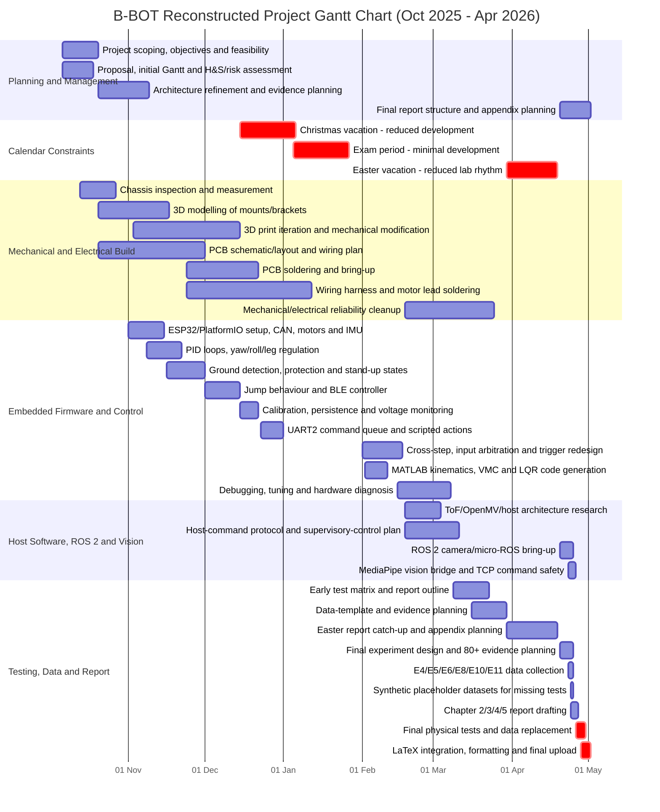
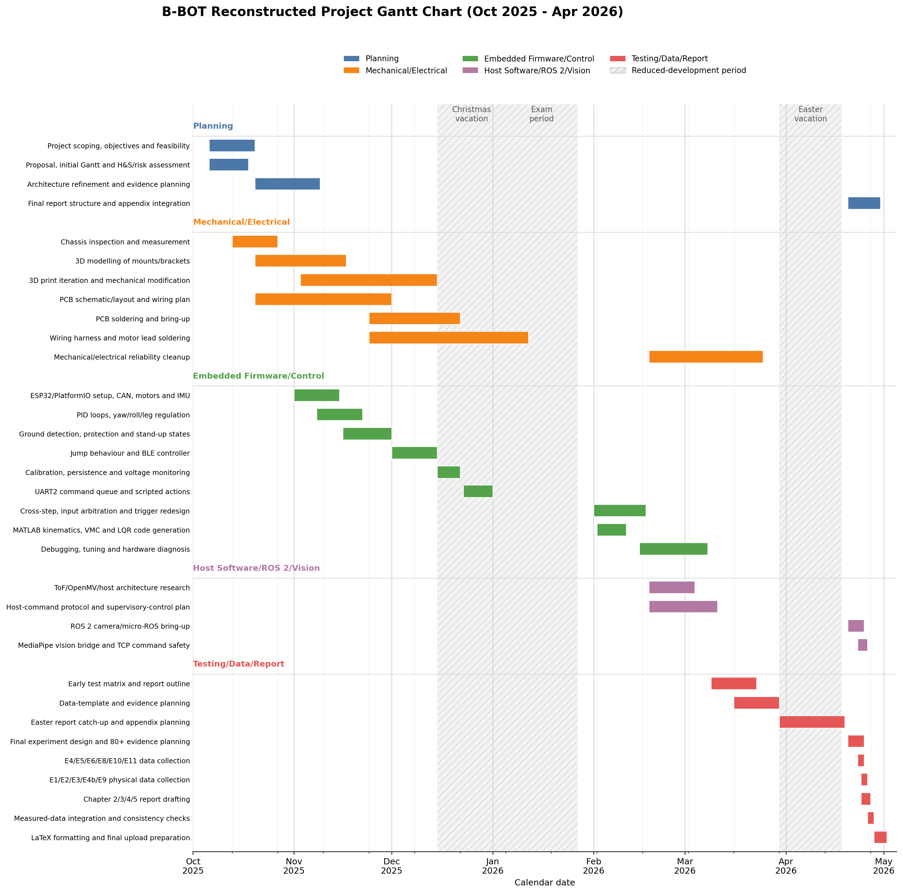

# Appendix B Draft: Project Plan, Gantt Chart and Weekly Activity Log

> Status: reconstructed draft for the final report appendix.  
> Scope: first week of October 2025 to 25 April 2026.  
> Basis: reconstructed from `Progress.md`, repository history, report-planning notes, experiment records, and known physical build activities that were not always captured in git. This should be presented as an updated/reconstructed project management record, not as a contemporaneous daily diary.

## B.1 Project Management Narrative

The project was managed as an iterative engineering build. The original intention was to progress from project scoping and risk assessment, through mechanical/electrical integration and embedded balance control, and then into wireless/vision extensions and final evaluation. In practice, the schedule shifted because the low-level wheel-legged balance controller, wiring reliability, motor integration and safety handling required more development time than originally expected. Host-side ROS 2 and vision work was therefore scoped as supervisory teleoperation rather than as part of the stabilising feedback loop.

The project also included substantial physical manufacturing work that is not fully represented by software commits. This included 3D modelling and revision of mounts/brackets, PCB schematic/layout work, printed part modification, PCB soldering, wiring harness construction, motor lead soldering, connector checks and repeated mechanical/electrical integration. These tasks were essential because unstable robot testing depends on reliable motor wiring, power distribution and mechanically secure sensor mounting.

Reduced-development periods were:

| Period | Reason | Project impact |
|---|---|---|
| 2025-12-15 to 2026-01-05 | Christmas vacation | Reduced lab time; mainly light firmware cleanup, documentation, calibration notes and command-system planning |
| 2026-01-05 to 2026-01-27 | Exam period | Minimal project development; focus shifted to revision and exams |
| 2026-03-30 to 2026-04-18 | Easter vacation | Lower formal contact/lab rhythm; used for catch-up, report planning, hardware cleanup and software architecture consolidation |

## B.2 Reconstructed Gantt Chart

Rendered version for preview/report integration:

## B.3 Weekly Activity Log

| Week | Dates | Main focus | Activities and outputs | Notes / status |
|---:|---|---|---|---|
| 1 | 2025-10-06 to 2025-10-12 | Project initiation | Defined the project direction around an ESP32 wheel-legged self-balancing robot; reviewed initial hardware capability; drafted early aims, feasibility and project risks. | Reconstructed from project context; aligns with proposal/H&S timing. |
| 2 | 2025-10-13 to 2025-10-19 | Proposal, risk and architecture | Prepared proposal/risk material; identified hazards from unstable balancing, high-torque motors, battery power and wireless commands; started system-level architecture planning. | H&S/risk work linked to Canvas deadline period. |
| 3 | 2025-10-20 to 2025-10-26 | Mechanical/electrical planning | Measured chassis and components; began 3D modelling of mounts/brackets; sketched PCB/wiring plan; reviewed motor, IMU and CAN integration requirements. | Includes physical design work not fully reflected in git. |
| 4 | 2025-10-27 to 2025-11-02 | Build preparation | Continued CAD and print planning; started PCB schematic/layout iteration; prepared ESP32/PlatformIO project structure; began checking motor wiring and connector requirements. | Bridges planning to first firmware implementation. |
| 5 | 2025-11-03 to 2025-11-09 | Hardware foundation firmware | Set up ESP32 + PlatformIO + Arduino framework; implemented CAN bus communication; initialised six motors; integrated MPU6050 DMP; created motor send and CAN receive tasks. | Reflected in `Progress.md` 2025/11/1-11/7. |
| 6 | 2025-11-10 to 2025-11-16 | PID and manual control foundations | Implemented cascade PID framework; added roll, leg length, leg angle and yaw PID loops; added gravity compensation; continued mechanical/electrical checks. | Reflected in `Progress.md` 2025/11/8-11/15. |
| 7 | 2025-11-17 to 2025-11-23 | Ground detection and landing behaviour | Added support-force calculation, touch detection, anti-bounce logic, airborne wheel disable and landing cushioning state machine; reset position target on landing. | Reflected in `Progress.md` 2025/11/16-11/22. |
| 8 | 2025-11-24 to 2025-11-30 | Protection, stand-up and wiring | Added leg-angle and pitch protection; implemented split-leg stand-up state machine; continued PCB soldering, wiring harness construction and motor lead/connector work. | Software reflected in `Progress.md`; physical work reconstructed. |
| 9 | 2025-12-01 to 2025-12-07 | Jump behaviour and physical iteration | Implemented jump preparation task; revised printed parts and mechanical mounting as needed; continued checking harness strain relief and motor wiring reliability. | Software reflected in `Progress.md`; physical work reconstructed. |
| 10 | 2025-12-08 to 2025-12-14 | Xbox BLE controller | Integrated NimBLE-Arduino; added Xbox controller scan/connect, button mappings and 50 Hz BLE processing task; tested manual input mapping. | Reflected in `Progress.md` 2025/12/8-12/14. |
| 11 | 2025-12-15 to 2025-12-21 | Christmas period - reduced work | Added motor calibration, NVS persistence, IMU debug commands, ADS1115 voltage monitoring and battery compensation; light hardware cleanup. | Christmas vacation started; reduced but non-zero work. |
| 12 | 2025-12-22 to 2025-12-28 | Christmas period - command system | Implemented UART2 command receiving and queue system; added movement/action commands, queue control and composite command parsing. | Reduced development period. |
| 13 | 2025-12-29 to 2026-01-04 | Christmas period - cleanup | Continued command queue cleanup, documentation and debugging notes; prepared to pause major development for exams. | Reduced development period. |
| 14 | 2026-01-05 to 2026-01-11 | Exam period | Minimal project development; priority shifted to exam revision. Reviewed design notes only where possible. | Exam season. |
| 15 | 2026-01-12 to 2026-01-18 | Exam period | Minimal project development; no major implementation milestone. | Exam season. |
| 16 | 2026-01-19 to 2026-01-25 | Exam period | Minimal project development; maintained project notes and post-exam restart plan. | Exam season. |
| 17 | 2026-01-26 to 2026-02-01 | Restart after exams | Resumed development; planned cross-step and input arbitration changes; rechecked hardware/firmware state after break. | Transition week. |
| 18 | 2026-02-02 to 2026-02-08 | Cross-step and kinematics | Added cross-step walking and BLE input enable/disable; generated MATLAB kinematics functions for leg position, speed, VMC conversion and LQR gains. | Reflected in `Progress.md` 2026/2/1-2/10. |
| 19 | 2026-02-09 to 2026-02-15 | LQR/VMC integration | Built leg pose update task; defined LQR state vector; integrated main `CtrlBasic_Task` at 4 ms; added wheel output = LQR + yaw PID. | Reflected in `Progress.md`. |
| 20 | 2026-02-16 to 2026-02-22 | Debugging and diagnosis | Reworked triggers for gentle stand-up; added leg motor test mode; added IMU serial debug; investigated ToF/OpenMV/host architecture; designed/printed sensor mounting base. | Reflected in `Progress.md` 2026/2/15-2/22. |
| 21 | 2026-02-23 to 2026-03-01 | Mechanical/electrical consolidation | Continued physical integration, printed part modification, PCB/wiring cleanup, harness reliability checks and motor soldering/connector improvements; continued control tuning. | Reconstructed physical build work not fully captured in git. |
| 22 | 2026-03-02 to 2026-03-08 | Hardware reliability and tuning | Iterated on mechanical fit and wiring strain relief; checked power distribution and sensor mounting; continued balance tuning and manual control testing. | Reconstructed. |
| 23 | 2026-03-09 to 2026-03-15 | Integration testing and early evidence planning | Combined embedded control, manual control, wiring and mechanical build into longer bench tests; started the early experiment matrix and identified what data would be needed for control, safety and teleoperation evidence. | Reconstructed; marks the start of Testing/Data/Report activity. |
| 24 | 2026-03-16 to 2026-03-22 | Test plan, design review and scope control | Reviewed navigation/vision ambitions against time and risk; began narrowing scope toward safe teleoperation and measurable evidence rather than full autonomy; prepared initial data-template and report-outline planning. | Reconstructed; aligns with later architecture decision. |
| 25 | 2026-03-23 to 2026-03-29 | Pre-Easter report and data consolidation | Prepared report outline and experiment ideas; continued hardware cleanup; identified need for latency, watchdog and repeatability evidence; organised the project evidence into control, communication/safety and vision categories. | Reconstructed. |
| 26 | 2026-03-30 to 2026-04-05 | Easter vacation | Reduced formal schedule; used time for catch-up, report planning, hardware review and software architecture consolidation. | Easter vacation. |
| 27 | 2026-04-06 to 2026-04-12 | Easter vacation | Continued catch-up; refined final-report positioning around local embedded balance plus supervisory teleoperation; prepared for ROS/camera bring-up. | Easter vacation. |
| 28 | 2026-04-13 to 2026-04-19 | Easter vacation / restart | Finalised plan to focus on measurable evidence; prepared experiment matrix, report outline and camera/host software route. | Easter vacation ended 2026-04-18. |
| 29 | 2026-04-20 to 2026-04-25 | Final integration, testing and report sprint | Brought up the ROS 2 WiFi camera module path; implemented ROS 2 `wheeleg_vision_bridge`; added WiFi TCP command safety; collected E4/E5/E6/E8/E10/E11 data; generated provisional datasets for missing physical tests; drafted Chapters 1-5 and references. | Reflected heavily in `Progress.md` and experiment data. |

## B.4 Key Schedule Deviations and Responses

| Deviation | Cause | Response | Effect on final report |
|---|---|---|---|
| More time spent on low-level balance control than planned | Wheel-legged dynamics, motor wiring and IMU/control tuning were more difficult than early planning assumed | Prioritised local ESP32 stabilisation and reduced ambition for full autonomous navigation | Strengthened the final architecture argument around local real-time control |
| Physical build work was larger than software commits suggest | CAD, printing, PCB work, soldering and wiring harness construction happened outside git | Reconstructed the project management record and linked physical work to integration risks | Appendix B explains non-git effort and manufacturing workload |
| ROS 2 was scoped away from low-level control | WiFi/ROS/camera timing is not deterministic enough for a 4 ms balance loop | Used ROS 2/MediaPipe only for supervisory teleoperation | Became a central design choice tested by E5/E10/E11 |
| Exam and vacation periods reduced continuity | Christmas, exam season and Easter break interrupted continuous lab work | Used reduced periods for documentation, planning, light cleanup and later sprint work | Project plan records realistic schedule constraints |
| Some physical experiments were not measured before report drafting | Full robot hardware/data availability lagged behind software and report timeline | Created clearly marked provisional datasets and analysis structure | Final submission must replace provisional rows with measured E1/E2/E3/E4b/E9 data |

## B.5 How This Appendix Should Be Used in the Final Report

In the main report, Section 1.4 should cite this appendix when discussing:

- how the project was planned and monitored;
- why the final system scope shifted toward safe supervisory teleoperation;
- how physical manufacturing and wiring work affected the schedule;
- how risk management influenced watchdogs, `dry_run`, `stunt_armed` and full-stop behaviour;
- why the final evidence package prioritised timing, fault injection, vision reliability and repeated balance tests.
