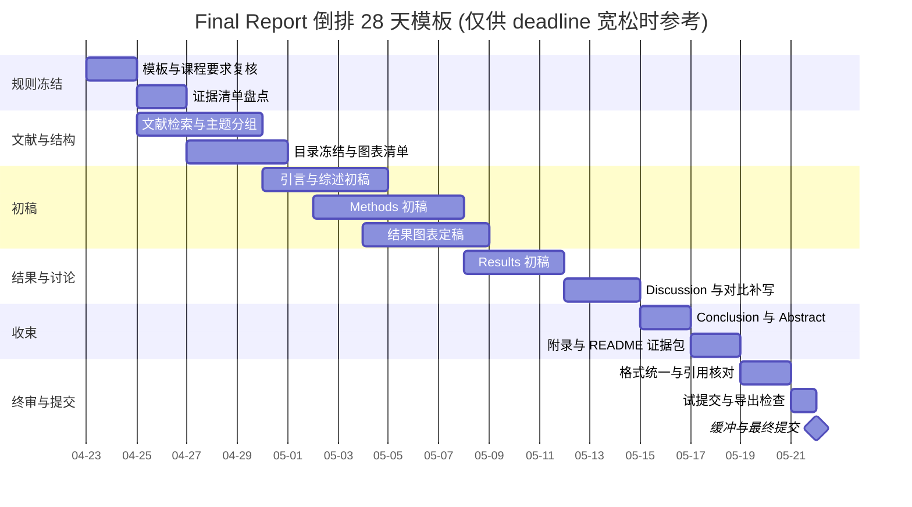

# 自平衡轮腿机器人 WiFi TCP 与 ROS 2 视觉遥操作 Final Report 可执行写作大纲与自查报告

## 执行摘要

对“自平衡轮腿机器人 + WiFi TCP + ROS 2 视觉遥操作”这类项目，final report 的最佳写法不是按开发时间线记录“我先做了什么、后来修了什么”，而是按“工程目标—系统分层—关键权衡—验证证据”来展开。对当前 B-BOT 代码而言，必须特别写清系统边界：底盘 ESP32 负责高频平衡控制和 WiFi TCP 命令入口，并不是 micro-ROS client；micro-ROS 当前用于 Yahboom 摄像头把图像发布到 ROS 2 主机，随后由 MediaPipe 视觉桥通过 TCP line protocol 给机器人发送命令。如果这些关系不在文稿里显式说明，读者就很难判断哪些结果能归因于底层控制器，哪些结果来自摄像头/ROS 2/视觉桥，哪些结果又受 WiFi TCP watchdog 与输入仲裁影响。

因此，下面给出的不是“范文式目录”，而是一套可以直接执行的写作蓝图：在你给定的**正文 35 页上限**下，反向安排 front matter、main body、appendices、检查清单、提交流程与时间表，使整篇报告形成一条完整证据链。尤其是代码仓库、README、`CITATION.cff`、数据/日志样例、风险评估和提交回执，不应被视为“可有可无的附件”，而应被视为可复现性、学术规范和审核可追溯性的一部分。citeturn5view0turn11search0turn11search6turn21search3turn23search1turn24search8

本报告同时采用一个保守原则：**学校专属硬约束只认官方模板与课程说明**。由于当前会话中无法访问你学校的模板原文，凡是学校专属而未被你在本轮消息中明示的条目，一律标注为“未指定/待原模板复核”。这比凭印象补规则更安全，也更适合真正执行。citeturn14search8turn15search10

## 适用边界与依据

在通用报告写作上，高校官方写作指南普遍强调几件事：abstract 应是独立、自足的全文快照；literature review 不能只是摘抄或逐篇摘要，而应按主题组织并作批判性分析；discussion 需要解释结果含义、与已有研究比较、指出限制和后续方向；通用模板与建议都要服从课程文件和具体读者需求。下文的大纲，就是在这些稳定原则之上，再结合 ROS 2 视觉、camera-side micro-ROS、WiFi TCP 命令通道、提交平台、代码文档与风险评估的官方资料，构造出的执行版模板。citeturn14search0turn14search11turn13search6turn13search1turn15search8turn15search10

| 学校专属项目 | 当前状态 | 执行动作 |
|---|---:|---|
| Title page 精确字段与版式 | **已确认**（Report Template 模板）| 采用模板第 1 页版式；填入标题、学号（前 7 位）、Supervisor、月份 |
| Declaration of originality 固定文字 | **已确认**（Report Template p.5 原文）| 整页原样保留 |
| Intellectual property statement 固定文字 | **已确认**（Report Template p.6 原文四条）| 整页原样保留 |
| Abstract 具体字数/页数 | Handbook 未硬性规定 | 按 1 页（~300–400 词）撰写 |
| 正文 35 页的统计口径 | **已确认**（Handbook §9.2）| 正文 ≤35 页；超页扣 5 分；保守控制在 32–33 页 |
| 提交平台 | **Canvas（非 Blackboard）**（Handbook §9.1）| PDF 上传 Canvas，2026-05-01 14:00 前 |
| 迟交扣分规则 | **已确认**（§9.1）| 仅几分钟迟交即扣最多 10 分；重交仍计迟交 |
| 评分 rubric / mark breakdown | **已确认**（§10.2）| 25% Overview+BG+Conclusions / 65% Technical / 10% Presentation |
| 是否匿名评分 | **否**（Supervisor + Independent Marker 双评）| 正常署名；无需去身份信息 |
| 页边距 / 字体 / 行距 | **已确认**（§9.2）| 四边 ≥2 cm；Calibri 12；1.5 倍行距；左对齐 |
| Project Management 独立小节 | **强制要求**（§9.3）| 正文内必须有，≤1 页 |
| 必备附录清单 | **已确认**（§9.4）| Proposal + Gantt + Risk Register + CPD + H&S + Repo Link，缺一扣分 |
| 第三方代码声明 | **强制要求**（§9.5, §14.5）| 附录 F 列出所有 imported/reused 代码及其 license |
| 仓库可见性 | **强制要求**（§14.1）| 提交时刻必须 public，建议打 release tag 固化版本 |

对这个题目而言，真正有“技术特异性”的写作依据主要来自四类资料：其一，ROS 2 / micro-ROS 文档用于解释摄像头图像进入 ROS 2 主机的边界，而不是宣称底盘 ESP32 已接入 ROS graph；其二，WiFi TCP、watchdog、输入仲裁和 FreeRTOS 任务模型来自本仓库实际代码；其三，README 与软件引用文档解释了如何把代码与复现信息打包为可审查证据；其四，风险评估和提交平台文档说明了安全、回执、late 标记与评分规则。citeturn4view0turn10search0turn11search0turn21search2turn23search0turn24search9

## 可执行写作大纲

以下页数分配以你给定的**正文 35 页上限**为硬约束，并有意预留 2–3 页缓冲。词数按**英文正文**经验值粗估，仅用于控制篇幅，不是学校硬规定。

技术报告常见而稳定的前置组件包括 title page、abstract、contents、list of figures/tables、symbols/abbreviations、references 与 appendices；其中 abstract 是对全文“做了什么、为什么做、怎么做、发现了什么、意味着什么”的独立概括，而 introduction 则负责背景、目标与章节路线，两者不能互相替代。citeturn14search9turn14search3turn14search0turn14search5

| 节次 | 建议长度 | 必写要点 | 建议图表/公式/表格类型及示例标题 | 写作提示 |
|---|---:|---|---|---|
| Title page | 1 页 | 按学校模板填写标题、作者/学号、课程/项目、日期、指导教师等 | 无 | **不自行设计版式**；若模板有固定顺序与 wording，逐字对齐 |
| Abstract | 1 页 | 问题、动机、方法、关键结果、结论、局限 | 一般不放图表；必要时不放引用 | 写成**独立可读**文本；不要写成 introduction 缩写版 |
| Contents | 1 页左右 | 章节、子节、页码 | 自动目录 | 用 Word/LaTeX 自动生成；不要手打页码 |
| List of Figures / Tables | 各 0.5–1 页 | 所有图表标题与页码 | 自动列表 | 图表多时强烈建议加入；可显著提高可导航性 |
| Nomenclature / Abbreviations | 0.5–1 页 | IMU、LQR、QoS、XRCE-DDS、符号表等 | 缩写表、符号表 | 缩写多、公式多时非常值回票价 |
| Declaration / IP statement | 按模板 | 若学校模板有固定页，原样保留 | 无 | 当前未指定；按学校模板执行 |
| Acknowledgements | 0–0.5 页 | 致谢 | 无 | 可选；只写对项目有实质支持的人与资源 |

在正文结构上，最稳妥的逻辑不是“时间顺序”，而是“问题—方法—证据—解释”。报告应让评阅人快速回答四个问题：**你要解决什么问题、你如何设计系统、你拿什么证明它有效、这些证据意味着什么**。这类工程题最怕 methods 碎成零件清单，results 退化成调参日记。citeturn14search5turn15search6turn22search5

| 节次 | 页数 / 英文词数估算 | 本节必须回答的问题 | 建议图表/公式/表格类型及示例标题 | 写作提示 |
|---|---:|---|---|---|
| Introduction：背景与工程动机 | 0.8–1.2 页 / 300–500 词 | 为什么是轮腿自平衡？为什么引入 WiFi TCP 和 ROS 2 视觉遥操作？问题的工程价值是什么？ | 图：**项目目标与系统边界概览** | 从“应用场景 + 约束”切入，不从“我一开始做了什么”开头 |
| Introduction：问题定义与范围 | 0.5–0.8 页 / 200–350 词 | 你的系统解决什么，不解决什么？哪些假设成立？ | 表：**In-scope / Out-of-scope 定义表** | 先把边界画清楚，后文会少很多争议 |
| Introduction：目标与成功判据 | 0.7–1.0 页 / 250–400 词 | 成功的可测指标是什么？如何判定“做成了”？ | 表：**Objectives, Metrics, Evidence Matrix** | 目标必须是**可验证**的，不要写成口号 |
| Introduction：报告地图 | 0.3–0.5 页 / 100–180 词 | 后续章节分别解决什么问题？ | 无 | 一段即可；不要重复 abstract |
| Literature review：轮腿与自平衡方向脉络 | 1.0–1.5 页 / 350–600 词 | 轮腿机器人相对传统两轮平衡机器人多了哪些问题？ | 图：**轮腿自平衡研究主题分类图**；表：**代表性系统对比** | 按问题分组：地形适应、重心变化、结构复杂度，而不是按作者分组 |
| Literature review：控制方法比较 | 1.5–2.0 页 / 500–800 词 | PID、LQR、ADRC、混合或分层控制各解决什么问题？代价是什么？ | 表：**控制方法假设与代价比较**；公式：**简化状态方程 / 代价函数示例** | 不要逐篇摘要；要比较“建模要求、状态量、算力、鲁棒性、调参难度” |
| Literature review：嵌入式 ROS 与视觉输入 | 1.0–1.2 页 / 350–500 词 | camera micro-ROS agent、ROS 2 host、视觉处理与机器人底盘之间的分层意义是什么？ | 图：**Camera-to-ROS2-to-Robot 分层架构示意图** | 讲“为什么这种分层能服务你的项目”，并明确底盘不是 micro-ROS 节点 |
| Literature review：WiFi TCP 与安全遥操作 | 0.8–1.0 页 / 250–400 词 | 有损/抖动链路对遥操作命令有什么影响？watchdog、断线停止和输入仲裁如何降低风险？ | 表：**Command channel / watchdog / failure mode 对照表** | 把通信写成**安全与实时性设计问题**，不是“连上就算做完” |
| Literature review：缺口与本文选择 | 0.5–0.8 页 / 180–300 词 | 你从文献里看到了什么缺口，因此本文怎么选型？ | 表：**Gap → Design Choice** | 必须用“因此本文……”把综述收束到你的方法 |
| Methods：需求与约束 | 0.8–1.0 页 / 300–450 词 | 质量、功耗、控制频率、网络方式、成本、调试便利性等要求是什么？ | 表：**Top-level Requirements Table** | 所有后续设计都要能回指到这里 |
| Methods：总体系统架构 | 1.5–2.0 页 / 600–900 词 | 系统由哪些层组成？数据怎么流动？快环与慢环如何分工？ | 图：**System Architecture and Data Flow**；图：**Control / Communication Timing Diagram** | 这是整篇报告的“脊梁”；建议用一张块图 + 一张时序图说清楚 |
| Methods：机械与电气设计 | 2.0–2.5 页 / 700–1000 词 | 结构、执行器、IMU、电源、驱动、连线如何设计？为什么这样选？ | 图：**机器人整机与关键部件照片**；图：**Power Tree**；表：**关键硬件参数表** | 不要沦为器件清单；每个关键部件都要回答“为什么选它” |
| Methods：感知与状态估计 | 1.2–1.8 页 / 450–700 词 | 姿态、轮速、腿部状态如何测得？如何滤波、校准、统一坐标？ | 公式：**姿态估计/滤波方程**；图：**Sensor Processing Pipeline**；表：**Calibration Parameters** | 坐标系、单位、符号、采样频率一定要统一 |
| Methods：控制架构 | 2.0–2.5 页 / 700–1000 词 | 哪些闭环在板端，哪些在上位机？控制律是什么？安全策略是什么？ | 图：**Hierarchical Control Block Diagram**；公式：**PID/LQR/状态空间示意**；图：**状态机** | 先解释结构，再给公式；公式要服务于系统设计，不要堆式子 |
| Methods：ROS 2 vision + WiFi TCP 通信设计 | 1.2–1.8 页 / 450–700 词 | 摄像头 topic、vision bridge、TCP command server、UART/queue 复用、watchdog 和安全门控如何设计？ | 表：**Command / Rate / Watchdog / Source Matrix**；图：**ROS Graph + TCP Command Topology** | 把“哪些流量留在 ROS 2、哪些命令走 TCP、哪些必须留在板端快环”讲清楚 |
| Methods：验证方案 | 0.8–1.0 页 / 300–450 词 | 你如何测试系统？指标是什么？试验次数、工况和日志策略是什么？ | 表：**Experiment Matrix and Pass Criteria** | 让别人“照着做”就能重复你的关键测试 |
| Results：上电与功能性验证 | 1.0–1.2 页 / 300–450 词 | 系统能否稳定启动、校准、通信和记录？ | 表：**Bring-up Checklist and Outcomes**；图：**系统在线状态截图** | 只保留对后续结论有贡献的 bring-up 结果 |
| Results：平衡性能 | 2.5–3.0 页 / 900–1200 词 | 平衡恢复、超调、稳定时间、抗扰性如何？ | 图：**Pitch Response Under Disturbance**；图：**Motor Command / Current / Angle 同步曲线**；表：**Performance Metrics Summary** | 每张图都要按“现象—原因—意义”解释，不能只贴曲线 |
| Results：腿部动作 / 变高 / 移动表现 | 1.5–2.0 页 / 500–800 词 | 改变姿态、腿长或移动命令后，平衡性能如何变化？ | 图：**不同工况下的状态响应对比**；表：**Condition-to-Condition Comparison** | 不只写“能动起来”，更要写“付出了什么代价” |
| Results：WiFi TCP + camera micro-ROS + 视觉遥操作性能 | 1.8–2.2 页 / 650–900 词 | TCP 命令入口延迟、watchdog 停止时间、摄像头 topic 帧率、视觉桥事件成功率如何？ | 图：**TCP Command Latency CDF**；图：**Watchdog Fault Timeline**；表：**Vision/Communication Performance Matrix** | 把通信结果与控制安全边界联系起来，而不是做成网络实验孤岛 |
| Results：综合讨论与局限 | 1.8–2.2 页 / 650–900 词 | 为什么会出现这些结果？与目标和文献相比如何？还有哪些局限？ | 表：**Objective vs Evidence vs Limitation** | discussion 先回答“为什么”，再回答“下一步怎么办” |
| Conclusions：目标闭环与贡献 | 1.0–1.2 页 / 300–450 词 | 每个 objective 是否完成？本文的工程贡献是什么？ | 表：**Objective Closure Matrix** | 这是“回答考题”，不是“再讲一遍 results” |
| Conclusions：限制与未来工作 | 0.8–1.2 页 / 250–450 词 | 最大局限是什么？下一步优先级怎么排？ | 表：**Future Work Priority / Impact / Effort** | future work 必须从局限自然生长出来，不要写空泛愿望 |

具体到轮腿自平衡方向，近年的公开研究已经给出了几条很适合你在 literature review 里做成“主题线索”的路径：其一，传统两轮自平衡机器人在复杂地面上的局限，推动了轮腿化设计；其二，LQR、ADRC 和混合 LQR-PD 等路线，分别围绕高度变化、重心变化与外界扰动做控制扩展；其三，评估不应只停在平地直立，还应包括软地面、碰撞、额外载荷和故障工况。把这些线索整理成比较表，比逐篇摘要更能服务后文 discussion。citeturn17search1turn17search4turn17search5

而在 methods 部分，**system architecture 与 execution model** 值得写深。对当前代码，最重要的不是泛泛介绍 micro-ROS executor，而是把 ESP32 上的 2--5 ms 级 FreeRTOS 控制任务、WiFi TCP 命令服务、UART2 队列、Xbox BLE 输入和 ROS 2/MediaPipe 视觉桥之间的边界画清楚。micro-ROS 资料可以用于解释 Yahboom camera image topic 如何进入 ROS 2 主机；ROS 2 QoS 资料可以用于解释图像/状态 topic 的背景；但底盘命令链路应按实际实现写成 TCP line protocol、direct-command watchdog、TCP idle watchdog 和断线 full-stop 机制。这样才能提前回答评阅人最可能质疑的问题：无线链路抖动为什么不会直接进入底层平衡闭环，以及视觉命令为什么只作为遥操作/事件触发。

## 附录与证据包

真正决定这份报告是否“像工程项目”的，往往不是正文里多写了多少形容词，而是附录和证据包是否能支撑复现。entity["company","GitHub","code hosting platform"] 的官方文档把 README 视为仓库访问者首先看到的说明页，建议它至少说明项目做什么、为什么有用、如何开始、到哪里求助以及谁维护；同一套文档也支持用 `CITATION.cff` 告诉别人如何引用你的软件，并支持把固定版本归档为 DOI。对课程项目而言，这意味着**仓库链接本身不够**，必须再补一个“冻结版本 + README + 运行步骤 + 样例数据”的证据包。citeturn5view0turn11search0turn11search6

| 附录项 | 是否建议必备 | 应包含的具体内容 | 最低通过标准 |
|---|---:|---|---|
| Appendix A：Project outline | 是 | 原始项目题目、初始目标、计划方法、里程碑、预期风险 | 与最终报告主题一致；若有偏离，在正文或附录说明原因 |
| Appendix B：Risk assessment | 是 | hazard、who might be harmed、existing controls、further actions、owner、deadline、review date、residual risk | 不是空白模板；包含项目特定风险与控制措施 |
| Appendix C：Code evidence package | 是 | 仓库地址或归档包、commit hash/tag、release 名称、依赖版本、license、目录结构、关键脚本入口 | 评阅人能定位你提交版本，而不是看到一个会持续变化的仓库主页 |
| Appendix D：README | 是 | overview、system architecture、hardware、software、build、run、agent 启动、topic 列表、expected output、known issues | 让新读者 15–30 分钟内能理解并启动最小演示 |
| Appendix E：Data / log samples | 是 | rosbag/CSV/串口日志/截图/关键曲线原始数据、命名规则、时间戳、采样率、字段解释 | 至少能支撑正文里的关键 2–3 张图 |
| Appendix F：Validation steps | 是 | bring-up 顺序、校准步骤、测试工况、pass criteria、故障回退策略 | 他人可按步骤重复你的关键试验 |
| Appendix G：Extended technical materials | 建议 | 长公式推导、完整 BOM、CAD 图、PCB 图、额外曲线、视频帧图 | 只放“有价值但太长不宜入正文”的内容 |
| Appendix H：Ethics / AI / disclosure | 视学校要求 | 若课程要求披露 AI 或第三方帮助，就按原要求填写 | 当前未指定；按学校政策执行 |

下面这份 README 模板可以直接复制后改写：

```markdown
# 项目名称

## Overview
一句话说明系统做什么；补 3–5 行说明应用场景与核心贡献。

## Why this project matters
说明工程问题、约束条件、为什么采用轮腿 + WiFi TCP + ROS 2 视觉遥操作这一路线。

## System Architecture
- 机械层
- 电气层
- 控制层
- 通信层
- 上位机层

## Hardware
- 主控板与固件版本
- IMU / 电机 / 驱动 / 电源
- 线缆与接口说明
- 安全注意事项

## Software
- 操作系统 / ROS 2 发行版
- micro-ROS agent 版本（用于 Yahboom camera image topic）
- Python / MediaPipe / OpenCV / TCP command tool 依赖
- 依赖包与安装方式
- 目录结构说明

## Build
逐步写清楚如何编译 MCU 固件与上位机工作区。

## Run
按顺序写：
1. 上电与安全检查
2. 启动网络
3. 启动摄像头 micro-ROS agent
4. 启动 ROS 2 节点
5. 启动 WiFi TCP 命令工具或视觉桥
6. 进入平衡/测试模式

## Topics / Commands / Watchdogs
| Name | Type | Direction | Rate | QoS/Watchdog | Purpose |

## Validation
- 如何做静态平衡测试
- 如何做扰动恢复测试
- 如何记录日志
- 预期输出长什么样

## Data and Logs
说明样例数据放在哪里、文件名规则、如何复现图表。

## Known Issues
诚实列出当前限制与失败工况。

## Future Improvements
只列 3–5 条最重要的下一步。

## Citation
给出 `CITATION.cff` 或推荐引用格式。

## Maintainers / Contact
项目维护者与更新时间。
```

风险评估部分建议按 entity["organization","Health and Safety Executive","uk safety regulator"] 的五步法组织：识别 hazard、识别谁可能受伤及如何受伤、评估现有控制与缺口、记录发现、定期复审；其模板字段至少应覆盖“谁会受伤及如何受伤、已有控制措施、还需要做什么、谁负责、何时完成”。这样写出的附录才不是“装饰性表格”，而是能同时服务于实验安全与结果解释的工程文件。citeturn21search2turn21search3turn21search8

## 核对表与审核事项

格式自查最容易漏掉的，不是“会不会做目录”，而是**章节层级、公式、图表、引用与页数统计是否前后一致**。按 entity["organization","IEEE","engineering society"] 风格，文内引用应使用方括号编号、参考文献按数字顺序排列；其编辑指南同时覆盖 section headings、numbers、equations 与 references。与此同时，图、表、公式都应先在正文中被引出，再出现编号与 caption；公式符号要定义，图表要解释关键观察，不能只靠图像“代替论证”。citeturn13search0turn19search0turn22search0turn22search5

| 勾选 | 项目 | 优先级 | 核对标准 |
|---|---|---:|---|
| ☐ | Title page 与学校模板逐字一致 | 高 | 字段、顺序、日期格式、是否要学号/导师名全部核对 |
| ☐ | Front matter 顺序正确 | 高 | Title page、abstract、contents、LoF/LoT、声明页等顺序符合模板 |
| ☐ | 目录、图表目录已更新 | 高 | 最终导出前执行一次全量更新 |
| ☐ | 正文页数在 35 页内 | 高 | 明确你的统计口径，并留 2–3 页缓冲 |
| ☐ | Heading 样式自动编号 | 高 | 不手打 1, 1.1, 1.1.1；层级清晰 |
| ☐ | 每张图、每个表、每个公式都在正文中被引用 | 高 | 不能出现“孤儿图表/公式” |
| ☐ | 图表 caption 一致 | 高 | 图题格式、大小写、语言、位置统一 |
| ☐ | 公式已编号，变量首次出现有定义 | 高 | 单位、坐标系、符号一致 |
| ☐ | 缩写首次出现已展开 | 中 | 如 IMU、LQR、QoS、XRCE-DDS |
| ☐ | 参考文献采用 IEEE 编号制 | 高 | 文内 [1]、[2]；文末数字顺序排列 |
| ☐ | 所有借鉴的图表/数据/代码/观点都有引用 | 高 | 包括从网页、论文、仓库、讲义来的内容 |
| ☐ | literature review 按主题组织 | 高 | 不能写成“作者 A 说……作者 B 说……”流水账 |
| ☐ | methods 体现系统分层与设计权衡 | 高 | 必须写清 fast loop / slow loop、板端/上位机、为何如此分工 |
| ☐ | results 不是原始日志堆砌 | 高 | 每个结果后都有解释与意义 |
| ☐ | discussion 包含对比与局限 | 高 | 对照目标、文献与失败工况进行解释 |
| ☐ | conclusion 明确闭合每个 objective | 高 | 逐条回答达成程度，而不是泛泛总结 |
| ☐ | 代码证据已冻结版本 | 高 | 有 tag / commit hash / archive |
| ☐ | README 可独立运行最小演示 | 高 | 不依赖口头补充 |
| ☐ | 数据/日志样例足以复现关键图表 | 高 | 至少对应正文中的核心结果 |
| ☐ | Project outline / risk assessment 已附 | 高 | 若学校要求，不能缺漏 |
| ☐ | 文件名、封面、元数据符合匿名/命名规则 | 高 | 若匿名评分，全部去身份信息 |
| ☐ | 最终导出文件可正常打开 | 高 | 字体、分页、公式、图片清晰无错位 |
| ☐ | 引用列表已做一致性检查 | 中 | 作者名、年份、页码、DOI、会议名无明显缺漏 |
| ☐ | AI 使用披露符合学校政策 | 高 | 当前未指定；必须回查课程要求 |

若学校通过 entity["company","Blackboard","learning platform"] 提交，你至少要做三件事：提交前确认 due date、attempt 限制和 rubric 是否可见；提交后**保存 confirmation number**；如果启用了 anonymous grading，就从文件名、封面和正文中删除个人身份信息。平台会把逾期作业标记为 late，但**具体扣分规则仍由教师/学校设定**，所以“迟交后果”不能只靠平台提示，必须回查你校 handout。原创性检查方面，SafeAssign 会生成匹配报告，但它本身不是自动评分器，是否构成学术不端仍要结合教师判断与上下文来解释。citeturn23search0turn23search1turn24search0turn24search8turn24search9

## 时间表与示例模板

> **⚠️ 已校正**：根据 Handbook §9.1，Final Report 截止时间为 **2026-05-01（周五）14:00**，Canvas 提交。今日 2026-04-23，**真实剩余时间为 8 天**，而非此前假设的 28 天。下方甘特图为 8 天冲刺版，**不要压缩最后一天**——Canvas 拥堵与上传失败都属于高频事故，迟到数分钟即扣最多 10 分。

```mermaid
gantt
    title Final Report 8 天冲刺倒排（2026-04-24 → 2026-05-01 14:00）
    dateFormat  YYYY-MM-DD
    axisFormat  %m-%d

    section 证据冻结
    附录材料定稿 (Gantt/Risk/CPD/H&S)   :a1, 2026-04-24, 1d
    实验数据采集与图表草图              :a2, 2026-04-25, 1d

    section 正文初稿
    Methods (§3)                        :b1, 2026-04-26, 1d
    Results & Discussion (§4)           :b2, 2026-04-27, 1d
    Intro / Lit Review / Conclusion     :b3, 2026-04-28, 1d

    section 收束
    Abstract + 排版 + 引用核对          :c1, 2026-04-29, 1d
    试提交 + 仓库公开打 tag             :c2, 2026-04-30, 1d

    section 提交
    正式提交 (≤14:00) + 保存回执        :milestone, d1, 2026-05-01, 0d
```

五个硬性里程碑：**D1 证据冻结、D2 数据冻结、D4 图表冻结、D6 论证闭环、D8 提交闭环**。其中”图表冻结”尤其关键：discussion 必须围绕图表写，图表没定则 results/discussion 反复返工——8 天压力下没有这种冗余。

**原 28 天模板（已过期，仅保留作为正常周期的参考）**：

<details>
<summary>展开查看原 28 天版本</summary>



</details>

**Methods 中 system architecture 的示例段落**

本文系统采用三层分层架构。底层由 ESP32 负责 \[f_fast] Hz 的姿态估计、电机输出与安全联锁，以保证所有时延敏感的平衡控制都在板端完成；中间层由 WiFi TCP 命令服务、UART2 队列和 Xbox BLE 输入组成，负责把人工控制、脚本控制和视觉控制统一注入同一套目标量/队列机制；上层主机则通过 Yahboom camera micro-ROS 图像 topic、ROS 2 节点和 MediaPipe 完成非实时视觉识别与命令生成。这样的拆分将“必须确定性执行”的控制回路与“可以容忍抖动”的视觉/遥操作回路分离，从而降低 WiFi 抖动和图像处理延迟对底层稳定性的直接影响。对于底盘命令，本文采用 TCP line protocol、500 ms direct-command watchdog、1500 ms TCP idle watchdog 和断线 full-stop；对于 ROS 2 图像与状态消息，则只在主机侧讨论 topic、帧率与 QoS 背景。

**Results 中 discussion 的示例段落**

在 \[工况 A] 下，系统能够在遭受 \[扰动类型] 后恢复直立，但恢复时间和峰值超调均随 \[腿长/速度/负载] 增大而上升。单看曲线，这一结果似乎只说明“性能变差”；但更重要的解释是，它揭示了系统瓶颈已经从执行器输出能力转移到状态估计质量与环路时延管理上。结合 \[日志/图号] 可以看到，扰动后最初阶段的控制输入并未立即饱和，而姿态估计噪声与命令抖动却显著上升，这表明在当前架构下，进一步提升稳定性未必首先依赖更强的电机，而更可能依赖更稳健的估计器、明确的命令 watchdog、以及对无线/视觉链路扰动的隔离策略。与 \[文献基线] 相比，本文系统在 \[某指标] 上表现 \[更好/更弱]，其主要原因在于 \[结构变化、控制简化、实验工况更严格或硬件资源限制]。

**Conclusion 的示例段落**

本文围绕“轮腿自平衡 + WiFi TCP + ROS 2 视觉遥操作”的系统目标，完成了从机械/电气集成、板端控制、命令仲裁到视觉输入验证流程的整体实现。结果表明，所提出的分层架构能够在 \[核心工况] 下实现 \[核心能力]，并且通过 \[实验类型] 证明了系统在 \[指标] 方面达到预期。然而，当前系统仍然受到 \[局限 1]、\[局限 2] 与 \[局限 3] 的约束，因此其主要贡献并不在于“全部性能最优”，而在于给出了一套在受限硬件与无线链路条件下可落地、可调试、可复现的工程实现路径。后续工作应优先面向 \[最高优先级改进]，其次才是 \[次级增强功能]。

**一页 Abstract 模板示例**

本文面向 \[应用场景] 中轮腿机器人在 \[复杂地面 / 姿态变化 / 无线部署] 条件下面临的平衡控制与系统集成问题，设计并实现了一套 WiFi-enabled 自平衡轮腿机器人系统，并扩展了 ROS 2/MediaPipe 视觉遥操作链路。针对传统两轮自平衡系统在 \[关键局限] 方面的不足，本文提出了由 ESP32 板端实时控制、WiFi TCP 命令入口、Xbox/UART/视觉输入仲裁和主机侧 camera micro-ROS 图像处理组成的分层架构，其中 ESP32 负责 \[高频任务]，ROS 2 主机负责 \[图像接入、视觉识别和非实时命令生成]。为验证系统有效性，本文构建了 \[静态平衡、扰动恢复、移动/变高、WiFi TCP 命令延迟、watchdog 停止、视觉事件] 等实验，并以 \[恢复时间、超调、命令入口延迟、watchdog 停止时间、摄像头帧率、CPU/RAM 占用] 作为主要评价指标。实验结果表明，该系统能够在 \[主要工况] 下实现 \[核心结果]，其中在 \[某类测试] 中表现出 \[主要发现]；同时，结果也揭示了 \[主要限制]，说明当前性能瓶颈更多来自 \[估计 / 通信 / 结构 / 参数整定] 而非 \[另一因素]。总体而言，本文的贡献在于：其一，完成了 \[关键系统集成贡献]；其二，建立了 \[验证流程 / 证据链 / 可复现实验框架]；其三，为后续开展 \[更强控制 / 更稳通信 / 更复杂运动能力] 提供了可扩展的工程基础。尽管当前系统仍存在 \[限制项]，但其设计与实验结果已经证明该架构对 \[目标应用或研究方向] 具有可行性与进一步优化价值。

## 建议优先查阅的来源

查阅优先级建议遵循一条简单原则：**先找本校硬规则，再查官方技术文档，最后用论文做比较与定位**。这是因为课程模板决定“交什么、怎么算、怎么罚”，而官方技术文档决定“系统到底怎么工作、哪些术语才准确”。citeturn14search8turn15search10turn19search0turn23search0

| 优先级 | 来源类型 | 你要从中得到什么 |
|---|---|---|
| 最高 | 学校官方模板、assessment brief、handbook、marking rubric | Title page、声明页、页数口径、提交入口、迟交规则、评分维度 |
| 很高 | micro-ROS 官方文档 | camera agent、XRCE-DDS、transport 与图像 topic 接入边界；不要据此宣称底盘 ESP32 是 micro-ROS 节点 |
| 很高 | ROS 2 官方文档 | topic/service 语义、图像/状态消息 QoS 背景、与你所用发行版一致的 API |
| 很高 | entity["company","GitHub","software hosting platform"] README / CITATION / 引用文档 | 代码证据、README 结构、软件引用、DOI 固化版本 |
| 很高 | entity["organization","Health and Safety Executive","uk safety regulator"] 风险评估模板与指南 | 风险评估附录应该记录什么 |
| 很高 | entity["company","Blackboard","learning management system"] 学生提交帮助与原创性检查说明 | 提交回执、late 标记、匿名评分、SafeAssign 说明 |
| 高 | 近三年轮腿/轮式双足/自平衡论文 | 你的 literature review 框架、baseline、discussion 对比对象 |
| 中 | 中文数据库与综述资源 | 快速建立学科地图、补中文术语、寻找硕博论文里的实验组织方式 |
| 低 | 非官方博客、论坛、视频 | 只用于排障思路，不作为正式方法依据 |

中文资源的优先顺序建议写成：**学校官方中文文件 > 学校图书馆已授权的中文数据库与学位论文库 > 中文综述或硕博论文 > 英文原始论文与官方文档**。如果你有校内授权，中文数据库可用来快速建立主题地图；例如，万方提供机构登录与学术检索服务，适合先搜“轮腿机器人”“自平衡机器人”“LQR ADRC”“ROS 2 嵌入式”等中文关键词。但一旦涉及 micro-ROS/ROS 2 的 API、camera agent、topic、transport 与发行版差异，仍应以官方文档和本仓库实际代码为准；对于底盘控制命令，应优先引用本项目的 WiFi TCP line protocol、watchdog 和输入仲裁实现，而不是套用 ROS 2 QoS 控制链路。citeturn25search0turn4view0turn10search0turn6search4turn6search5
